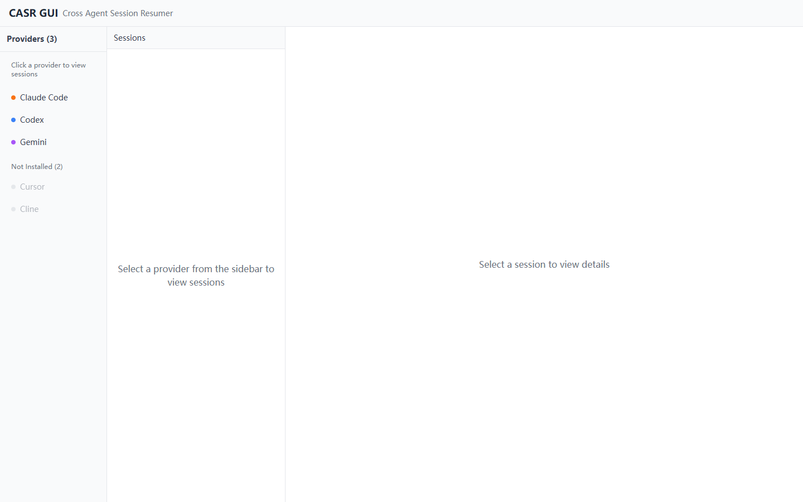
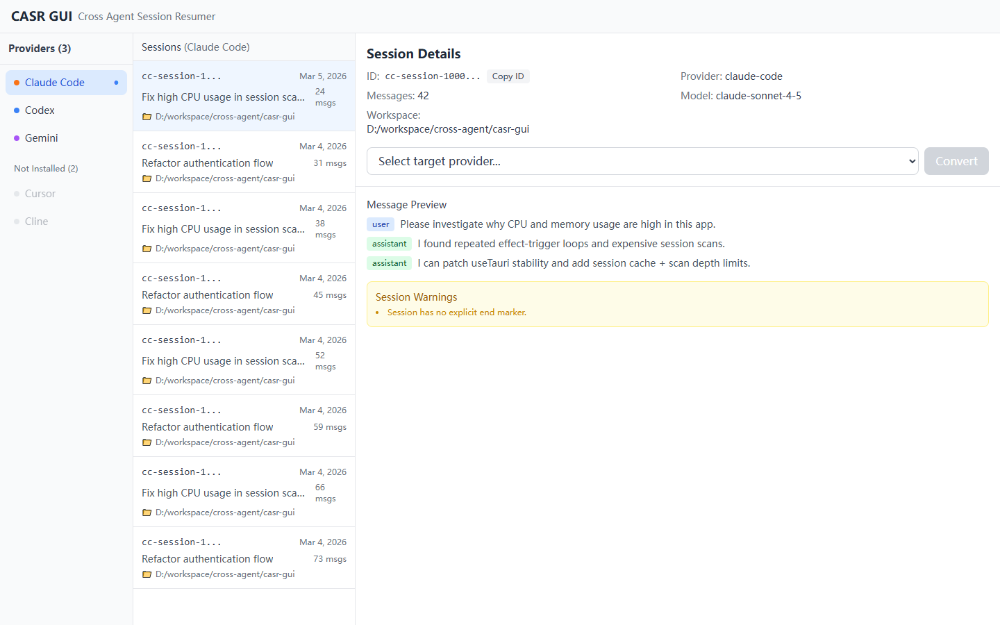
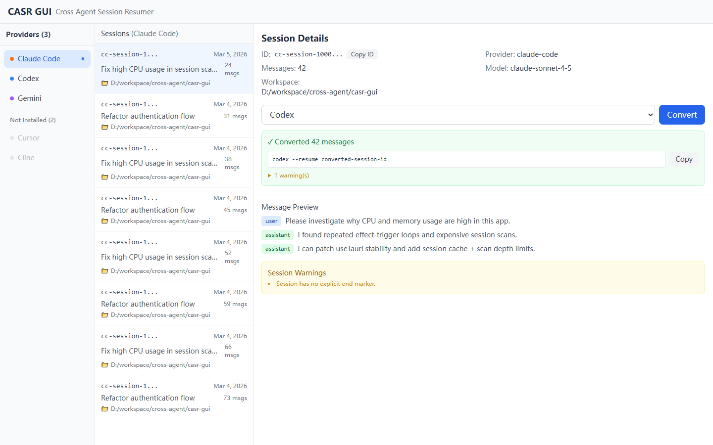

# CASR GUI Documentation (English)

## 1. Overview

CASR GUI is a desktop application for browsing, inspecting, and converting AI coding sessions across providers.

It is built on top of the `casr` core library and adds:

- visual provider detection
- session browsing UI
- per-session preview
- one-click cross-provider conversion
- ready-to-copy resume command and session ID

This app currently supports 14 providers:

- Claude Code
- Codex (OpenAI)
- Gemini
- Cursor
- Cline
- Aider
- Amp
- OpenCode
- ChatGPT
- ClawdBot
- Vibe
- Factory
- OpenClaw
- Pi Agent

## 2. Tech Stack

- Frontend: React 19 + TypeScript + Tailwind CSS + Vite
- Desktop runtime: Tauri v2
- Backend: Rust (`src-tauri/`)
- Core conversion logic: local `casr` dependency (`../../session-resumer`)

## 3. Project Structure

```text
casr-gui/
  src/                        # React frontend
    App.tsx
    components/
      ProviderSidebar.tsx
      SessionList.tsx
      SessionDetail.tsx
    hooks/
      useTauri.ts             # Tauri invoke wrappers
    types/
      index.ts

  src-tauri/                  # Rust backend
    src/
      main.rs
      lib.rs
      commands/
        providers.rs          # get_providers
        sessions.rs           # list_sessions + get_session
        convert.rs            # convert_session
    tauri.conf.json
```

## 4. Prerequisites

- Node.js 18+
- Rust toolchain (stable)
- Tauri desktop dependencies for your OS
- WebView2 runtime on Windows (typically already installed)

## 5. Development

Install dependencies:

```bash
npm install
```

Run development mode:

```bash
npm run tauri dev
```

What happens:

- Vite starts on `http://localhost:1420`
- Tauri launches the desktop shell and connects to Vite
- Rust backend hot-rebuilds when files in `src-tauri/` change

## 6. Production Build

Build frontend + desktop bundle:

```bash
npm run tauri build
```

Output is generated under:

- `src-tauri/target/release/bundle/`

## 7. User Workflow

1. Open app
2. Select a provider in the left sidebar
3. Pick a session from the middle list
4. Inspect session metadata and preview in the right panel
5. Choose a target provider and click `Convert`
6. Copy `resume command` and continue in target agent
7. Optionally click `Copy ID` to copy full session ID

## 8. Product UI

The screenshots below show the current product interface (captured with local demo data in development mode).

### App Overview



### Session Details



### Conversion Result



## 9. IPC Command Reference

The frontend invokes these Tauri commands:

### `get_providers`

- Request: no params
- Response: `ProviderInfo[]`

### `list_sessions`

- Request:
  - `provider?: string`
  - `limit?: number`
  - `sort?: "date" | "messages" | "provider"`
- Response: `SessionSummary[]`

### `get_session`

- Frontend invoke payload keys:
  - `sessionId: string`
  - `sourceHint?: string`
- Rust command signature:
  - `session_id: String`
  - `source_hint: Option<String>`
- Response: `SessionDetail`

### `convert_session`

- Frontend invoke payload keys:
  - `target: string`
  - `sessionId: string`
  - `force?: boolean`
  - `enrich?: boolean`
- Response: `ConvertResult`

## 10. Frontend Data Types

Defined in [`src/types/index.ts`](./src/types/index.ts):

- `ProviderInfo`
- `SessionSummary`
- `SessionDetail`
- `MessagePreview`
- `ConvertResult`

These mirror backend response models and should be updated together when changing payload contracts.

## 11. Performance Design

Recent optimizations:

- Stable Tauri invoke methods:
  - `useTauri` now uses `useCallback` + `useMemo` to prevent effect-trigger loops
- Session list cache:
  - in-memory cache keyed by `provider|limit|sort`
  - TTL: 60s
  - max entries: 24
- Safer backend scanning:
  - fallback directory walk uses `max_depth(4)`
- UTF-8 safe preview truncation:
  - message preview truncates by characters, not raw byte index

## 12. Troubleshooting

### A. High CPU / Memory in dev

Check:

- repeated provider/session reload loops (fixed by stable hooks)
- very large provider storage trees
- running multiple `tauri dev` instances

Actions:

- restart app
- keep only one dev process
- verify latest code with cache + depth limit

### B. `invalid args sessionId` style errors

Cause:

- frontend payload key mismatch for Tauri commands

Fix:

- use `sessionId` / `sourceHint` on invoke payload

### C. Panic: `byte index ... is not a char boundary`

Cause:

- byte slicing UTF-8 strings with multibyte characters

Fix:

- truncate with `.chars().take(n)` instead of `[..n]`

### D. Session not found

Check:

- provider selected correctly
- source session still exists on disk
- provider app/session path is accessible

## 13. Security & Privacy Notes

- This app reads local session data from provider directories.
- It does not require cloud upload to inspect or convert sessions.
- Converted content may include message history and context enrichment, depending on options.

## 14. Contribution Guide (Short)

Recommended process:

1. Create branch
2. Implement + test (`npm run build`, `cargo check`)
3. Open PR with:
   - behavior summary
   - screenshots for UI changes
   - migration notes if payload shape changed

## 15. License

MIT
